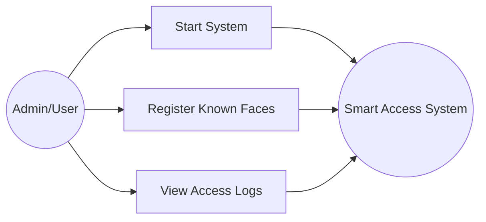
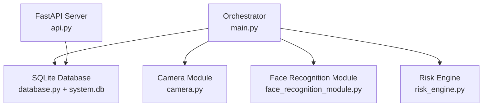
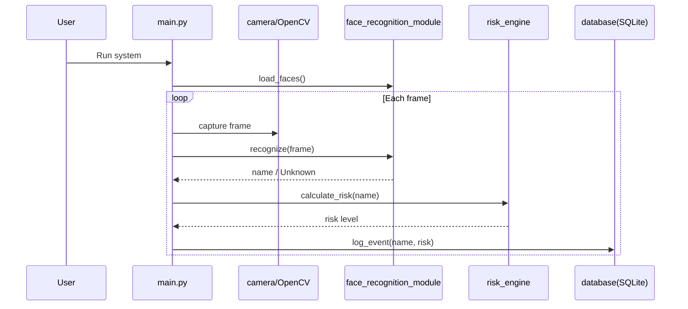
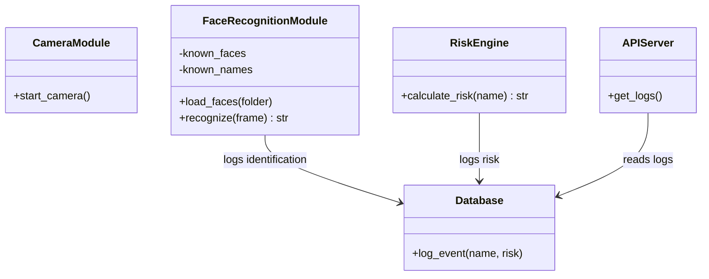

# UML Diagrams (Mermaid)

## Use Case Diagram

```mermaid
flowchart LR
    Admin((Admin/User)) --> UC1[Start System]
    Admin --> UC2[Register Known Faces]
    Admin --> UC3[View Access Logs]
    System((Smart Access System))
    UC1 --> System
    UC2 --> System
    UC3 --> System
```

## Component Diagram

```mermaid
flowchart TB
    Cam[Camera Module\ncamera.py]
    FR[Face Recognition Module\nface_recognition_module.py]
    Risk[Risk Engine\nrisk_engine.py]
    DB[SQLite Database\ndatabase.py + system.db]
    API[FastAPI Server\napi.py]
    Main[Orchestrator\nmain.py]

    Main --> Cam
    Main --> FR
    Main --> Risk
    Main --> DB
    API --> DB
```

## Sequence Diagram (Runtime)

```mermaid
sequenceDiagram
    participant User
    participant Main as main.py
    participant Cam as camera/OpenCV
    participant FR as face_recognition_module
    participant Risk as risk_engine
    participant DB as database(SQLite)

    User->>Main: Run system
    Main->>FR: load_faces()
    loop Each frame
        Main->>Cam: capture frame
        Main->>FR: recognize(frame)
        FR-->>Main: name / Unknown
        Main->>Risk: calculate_risk(name)
        Risk-->>Main: risk level
        Main->>DB: log_event(name, risk)
    end
```

## Class Diagram (Logical)

```mermaid
classDiagram
    class CameraModule {
      +start_camera()
    }

    class FaceRecognitionModule {
      +load_faces(folder)
      +recognize(frame) str
      -known_faces
      -known_names
    }

    class RiskEngine {
      +calculate_risk(name) str
    }

    class Database {
      +log_event(name, risk)
    }

    class APIServer {
      +get_logs()
    }

    FaceRecognitionModule --> Database : logs identification
    RiskEngine --> Database : logs risk
    APIServer --> Database : reads logs
```
